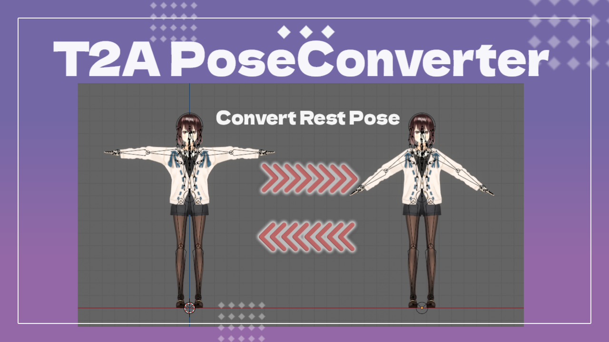

# Pose Converter

## Overview
Pose Converter is a Blender addon that allows you to copy a pose from one armature to another and apply it as the new rest pose. This is useful for transferring poses between characters, even if their rest poses (e.g., T-pose vs. A-pose) are different. The addon properly handles meshes with shape keys, rebuilding them to work with the new rest pose.

This is a modified version of the original T2A Pose Converter, generalized to work with any source and target pose.

## Features
- **Copy Pose**: Copy a pose from a target armature to a source armature.
- **Built-in Presets**: Includes default Male and Female A-pose presets (using `.blend` files).
- **Apply as Rest Pose**: Apply the new pose as the rest pose for the armature and its associated meshes.
- **Shape Key Support**: Automatically rebuilds shape keys to conform to the new rest pose.
- **Smart Matching**: Handles armatures with different bone naming conventions (e.g., `mixamorig:Hips` vs. `Hips`).

## Requirements
- Blender 3.6 or higher

## Installation
1. From Blender's menu, select "Edit" → "Preferences".
2. Select the "Add-ons" tab and click the "Install" button.
3. Select the `Pose_converter.zip` file.
4. Enable the "Pose Converter" addon by checking the checkbox.

## Usage

### Basic Usage
1.  **Select Source Armature**: In the 3D View, select the armature you want to modify. This is your **Source**.
2.  **Select Target Source**: In the addon panel (N key > "FireRat" tab), choose one of the following:
    *   **Custom**: Allows you to select another armature in the scene to copy the pose from.
    *   **Default Male**: Applies a standard Male A-pose.
    *   **Default Female**: Applies a standard Female A-pose.
3.  **Match Pose**: Click the **"Match Pose & Apply Rest"** button.

The addon will perform the following steps:
1.  The Source armature will snap to match the Target armature's pose.
2.  This new pose will be applied as the rest pose.
3.  Any meshes skinned to the Source armature will be updated.
4.  If those meshes have shape keys, they will be rebuilt to work with the new rest pose.

### Customizing Default Poses
The "Default Male" and "Default Female" options rely on `.blend` files located in the addon directory. You can replace these with your own custom poses:
1.  Navigate to the installed addon folder (usually `%APPDATA%\Blender Foundation\Blender\<version>\scripts\addons\Pose_converter`).
2.  Replace `male_default.blend` or `female_default.blend` with your own Blender file containing an armature in the desired pose.
    *   The addon will temporarily import the armature from this file, copy its pose, and then delete it.

### Set Current Pose as Rest Pose
If you have manually posed an armature and want to apply that pose as the new rest pose without copying from another target, you can use the **"Apply Current Pose as Rest"** button in the Utilities section. This performs the same mesh and shape key updates as the main operator.

## About Bone Matching
The addon matches bones between the two armatures by their base names. It automatically strips common prefixes (like `mixamorig:`) before comparing, so `mixamorig:Hips` on the target will correctly match `Hips` on the source.

## About Shape Key Processing
This addon specifically supports processing meshes with shape keys:
1. Saves the pre-conversion mesh state as a temporary shape key.
2. Applies the new pose to the armature and sets it as the rest pose.
3. Rebuilds all existing shape keys to match the new rest pose.

This ensures that shape key effects are properly maintained after the conversion.

## Notes
- It is strongly recommended to **backup your model** before using this tool.
- Processing may take some time for meshes with many shape keys.
- Always verify that the model and its shape keys function correctly after conversion.

## License
MIT License

## Author
- Original T2A Pose Converter by CatHut
- Modified by FireRat